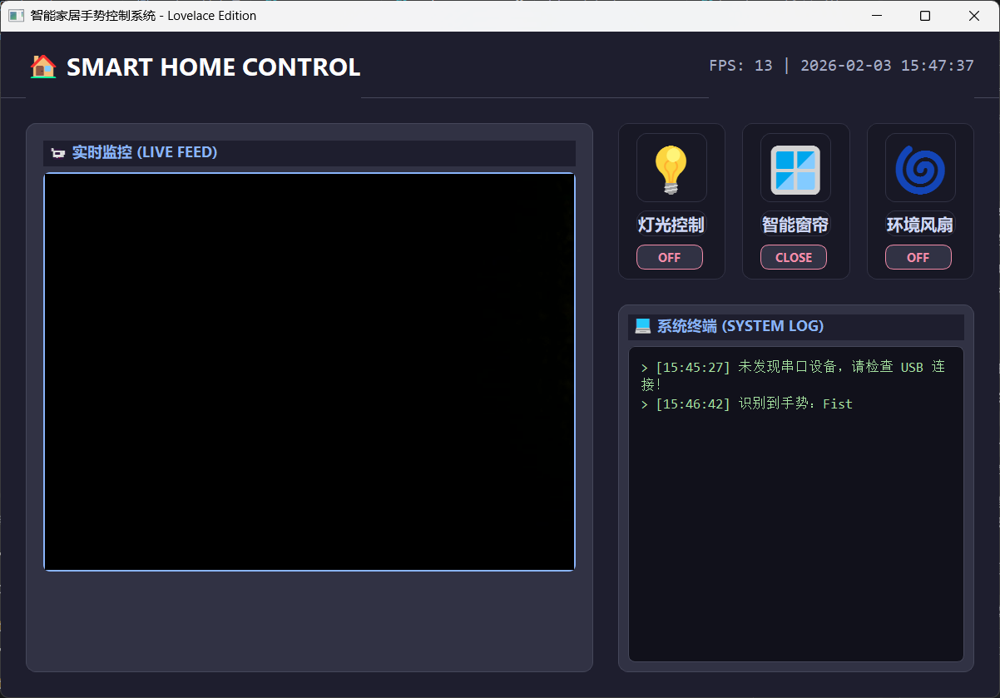

# SmartGestureHome

<p align="center">
  
  
  
  
</p>

<p align="center">
  基于手势识别的智能家居控制系统 — 用手势控制你的家
</p>

<p align="center">
  
</p>

---

## 目录

- [功能特性](#功能特性)
- [手势映射](#手势映射)
- [安装](#安装)
- [运行](#运行)
- [项目结构](#项目结构)
- [硬件要求](#硬件要求)
- [贡献](#贡献)
- [许可证](#许可证)

## 功能特性

- **12 种手势识别** — 张手、握拳、剪刀手、单指、OK、点赞、三指、四指、摇滚、小指、打电话、竖中指
- **实时摄像头预览** — MediaPipe 手部追踪 + 骨架绘制
- **手势去抖动** — 滑动窗口滤波，防止误识别
- **串口通信** — 自动搜索 ESP32 串口，发送控制指令
- **智能家居 GUI** — PyQt5 深色主题界面，实时显示设备状态和系统日志

## 手势映射

| 手势 | 指令 | 控制设备 |
|:-----|:----:|:---------|
| 张手 (Palm Open) | `A` | 灯光 ON |
| 握拳 (Fist) | `B` | 灯光 OFF |
| 剪刀手 (Victory) | `C` | 窗帘 OPEN |
| 单指 (One Finger) | `D` | 窗帘 CLOSE |
| OK | `E` | 风扇 ON |
| 点赞 (Thumbs Up) | `F` | 风扇 OFF |
| 三指 (Three Fingers) | `G` | 电视 ON |
| 四指 (Four Fingers) | `H` | 电视 OFF |
| 摇滚 (Rock) | `I` | 空调 ON |
| 小指 (Pinky) | `J` | 空调 OFF |
| 打电话 (Call Me) | `K` | 音响 ON |
| 竖中指 (Middle Finger) | `L` | 音响 OFF |

## 安装

```bash
# 克隆仓库
git clone https://github.com/chi-ga/SmartGestureHome.git
cd SmartGestureHome

# 安装依赖
pip install -r requirements.txt
```

## 运行

```bash
python system_main.py
```

| 按键 | 功能 |
|:-----|:-----|
| `S` | 切换自动截图模式 |

## 项目结构

```
SmartGestureHome/
├── system_main.py        # 主程序：GUI + 视频流 + 串口通信
├── hand_gesture_logic.py # 手势识别算法（MediaPipe）
├── protocol.txt          # 串口通信协议定义
├── requirements.txt      # Python 依赖
└── README.md             # 项目说明
```

## 硬件要求

- 摄像头（USB 或内置）
- ESP32 开发板（通过串口连接）
- 支持串口指令的智能家居设备（LED、舵机、风扇等）

## 贡献

欢迎提交 Issue 和 Pull Request！

1. Fork 本仓库
2. 创建你的分支 (`git checkout -b feature/xxx`)
3. 提交改动 (`git commit -m 'add: xxx功能'`)
4. 推送到分支 (`git push origin feature/xxx`)
5. 提交 Pull Request

## 许可证

本项目基于 [MIT License](LICENSE) 开源。
